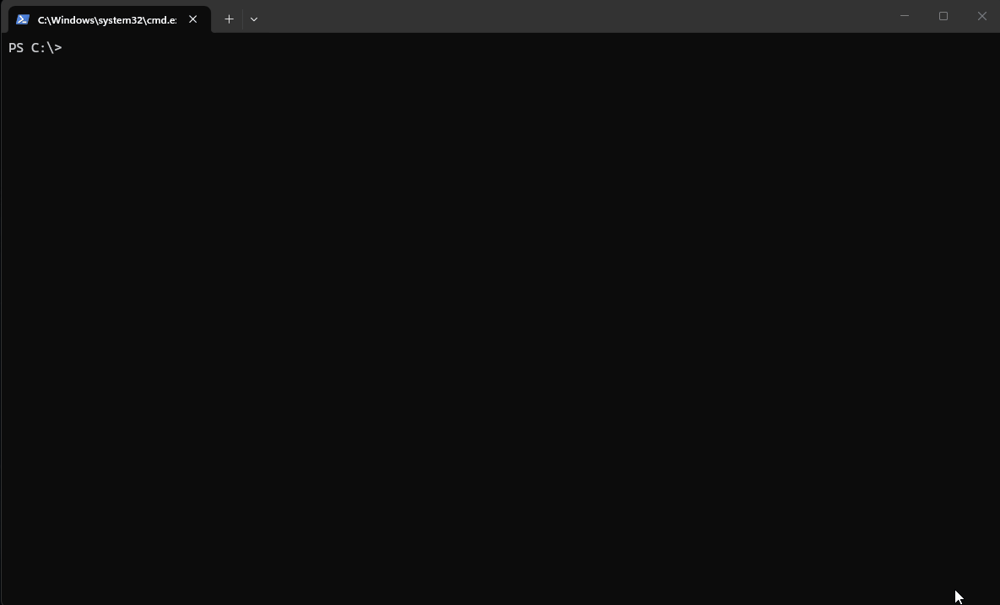

<h1 align="center">
  
  <br>
  muxd
</h1>

<p align="center">
  <b>An open-source AI coding agent that lives in your terminal.</b><br>
  <sub>Multiplex conversations across terminal, hub, and web. Branch, resume, and search your AI history like git.</sub>
</p>

<p align="center">
  
  <a href="https://github.com/batalabs/muxd/releases"></a>
  <a href="https://github.com/batalabs/muxd/commits/main"></a>
  <a href="#install"></a>
  
  <a href="LICENSE"></a>
</p>

> 📖 **Full documentation at [muxd.sh/docs](https://muxd.sh/docs)** — setup guides for [client](https://muxd.sh/docs/client) and [hub](https://muxd.sh/docs/hub) modes, [commands](https://muxd.sh/docs/commands), [tools](https://muxd.sh/docs/tools), and [configuration](https://muxd.sh/docs/configuration).

---

## Why muxd?

- **Persistent sessions** — conversations saved to local SQLite. Close your terminal, reboot, come back next week.
- **Branch and fork** — explore alternatives without losing your current thread, like git branches.
- **Project memory** — the agent remembers your conventions, architecture decisions, and gotchas across sessions.
- **Multi-channel** — same agent from terminal, hub, mobile app, or headless daemon.
- **Any provider** — Claude, GPT, Mistral, Grok, Fireworks, Ollama, and any OpenAI-compatible API.

---

## Demo

<p align="center">
  
</p>

---

## Install

**Windows (PowerShell)**
```powershell
irm https://raw.githubusercontent.com/batalabs/muxd/main/install.ps1 | iex
```

**macOS / Linux**
```bash
curl -fsSL https://raw.githubusercontent.com/batalabs/muxd/main/install.sh | bash
```

**From source** (requires [Go 1.25+](https://go.dev/dl/))
```bash
go install github.com/batalabs/muxd@latest
```

**Prerequisites**: git (for undo/redo) and an API key for at least one [supported provider](https://muxd.sh/docs/configuration).

---

## Quick start

```bash
muxd                              # start a new session
```

Set your API key:
```
/config set anthropic.api_key sk-ant-...
```

Resume a session:
```bash
muxd -c                           # resume latest session
```

See [muxd.sh/docs](https://muxd.sh/docs) for daemon mode, hub setup, slash commands, keybindings, and CLI flags.

---

## Contributing

```bash
git clone https://github.com/batalabs/muxd.git
cd muxd
go build -o muxd.exe .
go test ./...
```

See [muxd.sh/docs/contributing](https://muxd.sh/docs/contributing) for code style and development guide.

---

## License

[Apache License 2.0](LICENSE)
