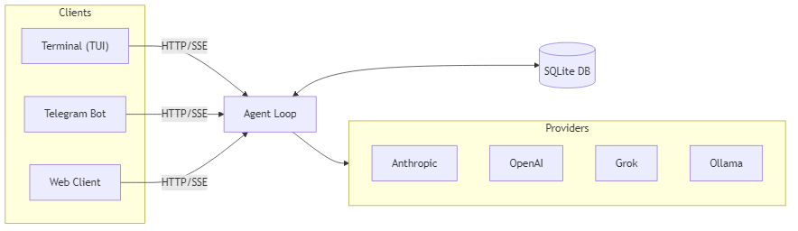

<h1 align="center">
  
  <br>
  muxd
</h1>

<p align="center">
  <b>An open-source AI coding agent that lives in your terminal.</b><br>
  <sub>Multiplex conversations across terminal, Telegram, and web. Branch, resume, and search your AI history like git.</sub>
</p>

<p align="center">
  
  <a href="https://github.com/batalabs/muxd/releases"></a>
  <a href="https://github.com/batalabs/muxd/commits/main"></a>
  <a href="#getting-started"></a>
  
  <a href="LICENSE"></a>
</p>

---

## Why muxd?

Most AI coding tools lock you into one conversation at a time and forget everything when you close the window. muxd is different:

- **Persistent sessions**: every conversation is saved to a local SQLite database. Close your terminal, reboot, come back next week, your context is still there.
- **Project memory**: persist project-specific facts across sessions. The agent remembers your conventions, architecture decisions, and gotchas.
- **Branch and fork**: explore alternative approaches without losing your current thread, just like git branches.
- **Multi-channel**: talk to the same agent from your terminal, Telegram, mobile app, or a headless daemon. Conversations sync across all of them.
- **Provider-agnostic**: switch between 9 providers with a single command.

---

## Demo

<p align="center">
  
</p>

---

## Features

### 33 Built-in Tools

| Category | Tools |
|----------|-------|
| **File ops** | `file_read`, `file_write`, `file_edit`, `list_files`, `patch_apply` |
| **Code search** | `grep`, `glob`, `bash`, `git_status` |
| **Web & HTTP** | `web_search`, `web_fetch`, `http_request` |
| **X / Twitter** | `x_post`, `x_search`, `x_mentions`, `x_reply`, `x_schedule` + management |
| **SMS** | `sms_send`, `sms_status`, `sms_schedule` |
| **Workflow** | `todo_read`, `todo_write`, `ask_user`, `plan_enter`, `plan_exit`, `task` |
| **Memory** | `memory_read`, `memory_write` |
| **Logging** | `log_read` — read recent daemon log entries |
| **Scheduling** | `schedule_task` — schedule multi-step agent tasks for future execution |

### 9 LLM Providers

| Provider | Config key | Notes |
|----------|------------|-------|
| Anthropic Claude | `anthropic.api_key` | |
| OpenAI | `openai.api_key` | GPT-4o, o1, etc. |
| Google Gemini | `google.api_key` | |
| Grok (xAI) | `grok.api_key` | |
| Mistral | `mistral.api_key` | |
| Fireworks | `fireworks.api_key` | |
| Ollama | `ollama.url` | Local models, no API key needed |
| zAI | `zai.api_key` | |
| Any OpenAI-compatible | `openai.api_key` | Works with any compatible endpoint |

### Session Management

- **Resume anywhere**: pick up where you left off with `/continue` or `Ctrl+R`
- **Branch conversations**: fork at any point with `/branch`
- **Auto-title & tags**: sessions are automatically named and tagged (bugfix, feature, refactor, etc.)
- **Context compaction**: long conversations are compressed to stay within token limits, persisted across restarts

### Agent Capabilities

- **Project memory**: save facts with `/remember` or let the agent use `memory_write` — they persist across sessions
- **Undo / redo**: git-based rollback for every change the agent makes
- **Plan mode**: read-only exploration that disables write tools until you're ready
- **Sub-agents**: delegate independent subtasks to a fresh agent instance
- **Scheduled tasks**: schedule full agent workflows to run at a future time, once or on a recurring basis
- **Mobile app**: connect from your phone with `/qr` — scan the QR code and chat with your agent on the go
- **Interactive shell**: drop into a shell with `/sh` that auto-detects cmd.exe, PowerShell, and bash commands on Windows
- **Streaming TUI**: real-time token streaming with markdown rendering, syntax highlighting, and table formatting

---

## Getting Started

### Install

**Windows (PowerShell)**
```powershell
irm https://raw.githubusercontent.com/batalabs/muxd/main/install.ps1 | iex
```

**macOS / Linux**
```bash
curl -fsSL https://raw.githubusercontent.com/batalabs/muxd/main/install.sh | bash
```

**From Source** (requires [Go 1.25+](https://go.dev/dl/))
```bash
go install github.com/batalabs/muxd@latest
```

**Prerequisites**: git (for undo/redo) and an API key for at least one provider.

### First Run

```bash
muxd                              # start a new session
```

Set your API key:
```
/config set anthropic.api_key sk-ant-...
```

Or via environment variable:
```bash
export ANTHROPIC_API_KEY=sk-ant-...
```

### Common Commands

```bash
muxd                              # new session
muxd -c                           # resume latest session
muxd -c <session-id>              # resume specific session
muxd -model claude-opus           # use a different model
muxd --daemon                     # headless daemon mode
muxd --daemon -bind 0.0.0.0       # daemon accessible from LAN / mobile
```

---

<details>
<summary><b>Slash Commands</b></summary>
<br>

| Command | Description |
|---------|-------------|
| `/help` | Show available commands |
| `/new` | Start a new session |
| `/sessions` | Interactive session picker (`Ctrl+R`) |
| `/continue <id>` | Resume a session by ID prefix |
| `/branch` | Fork conversation at current point |
| `/rename <title>` | Rename current session |
| `/remember <key> <value>` | Save a fact to project memory |
| `/config show` | Show all preferences |
| `/config set <key> <value>` | Set a preference |
| `/tools list` | List all tools and their status |
| `/tools enable/disable <tool>` | Toggle individual tools |
| `/schedule add <tool>` | Schedule a tool to run later |
| `/schedule add-task <time> <prompt>` | Schedule a multi-step agent task |
| `/tweet <text>` | Post to X/Twitter |
| `/emoji` | Pick a footer emoji |
| `/qr` | Show QR code for mobile app connection |
| `/sh` | Drop into the muxd interactive shell |
| `/undo` / `/redo` | Roll back or replay agent changes |
| `/clear` | Clear the chat |
| `/exit` | Quit muxd |

</details>

<details>
<summary><b>Key Bindings</b></summary>
<br>

| Key | Action |
|-----|--------|
| `Enter` | Submit input or accept completion |
| `Ctrl+C` / `Esc` | Cancel agent, dismiss completions, or quit |
| `Ctrl+J` | Insert a newline |
| `Ctrl+R` | Open session picker |
| `Tab` / `Shift+Tab` | Cycle autocomplete |
| `Up` / `Down` | Browse input history |
| `Ctrl+V` | Paste from clipboard |
| `Ctrl+Y` | Copy last assistant message |
| `Ctrl+K` | Copy full transcript |

</details>

<details>
<summary><b>CLI Flags</b></summary>
<br>

| Flag | Default | Description |
|------|---------|-------------|
| `-c` | | Resume a session (latest for cwd, or pass a session ID) |
| `-model` | | Model name or alias (e.g. `claude-sonnet`, `gpt-4o`) |
| `-daemon` | `false` | Run in daemon mode (no TUI) |
| `-bind` | `localhost` | Network interface to bind (`localhost`, `0.0.0.0`, or specific IP) |
| `-version` | | Print version and exit |
| `-service` | | Service management: `install` \| `uninstall` \| `status` \| `start` \| `stop` |

</details>

---

## Architecture

muxd uses a client/server architecture. The TUI connects to an agent loop via HTTP/SSE, so the same agent can serve terminal, Telegram, and web clients simultaneously.

<p align="center">
  
</p>

Built with:
- [Bubble Tea](https://github.com/charmbracelet/bubbletea) for the TUI framework
- [Lipgloss](https://github.com/charmbracelet/lipgloss) for terminal styling
- [Chroma](https://github.com/alecthomas/chroma) for syntax highlighting
- [modernc.org/sqlite](https://pkg.go.dev/modernc.org/sqlite) for pure-Go SQLite (no CGo)

---

## Documentation

Full documentation is at [muxd.sh/docs](https://muxd.sh/docs).

| Topic | Link |
|-------|------|
| Commands | [muxd.sh/docs/commands](https://muxd.sh/docs/commands) |
| Configuration | [muxd.sh/docs/configuration](https://muxd.sh/docs/configuration) |
| Tools | [muxd.sh/docs/tools](https://muxd.sh/docs/tools) |
| Project Memory | [muxd.sh/docs/project-memory](https://muxd.sh/docs/project-memory) |
| Undo / Redo | [muxd.sh/docs/undo-redo](https://muxd.sh/docs/undo-redo) |
| Architecture | [docs/architecture.md](docs/architecture.md) |
| Security | [docs/security.md](docs/security.md) |
| Contributing | [muxd.sh/docs/contributing](https://muxd.sh/docs/contributing) |

---

## Contributing

```bash
git clone https://github.com/batalabs/muxd.git
cd muxd
go build -o muxd.exe .
go test ./...
go vet ./...
```

See [muxd.sh/docs/contributing](https://muxd.sh/docs/contributing) for code style, testing conventions, and the full development guide.

---

## License

[Apache License 2.0](LICENSE)
