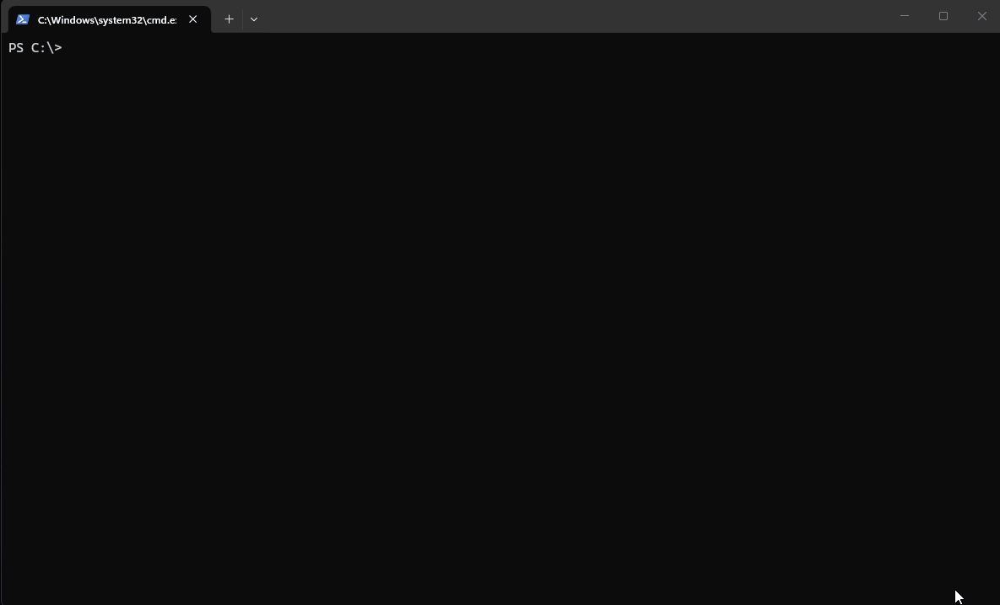
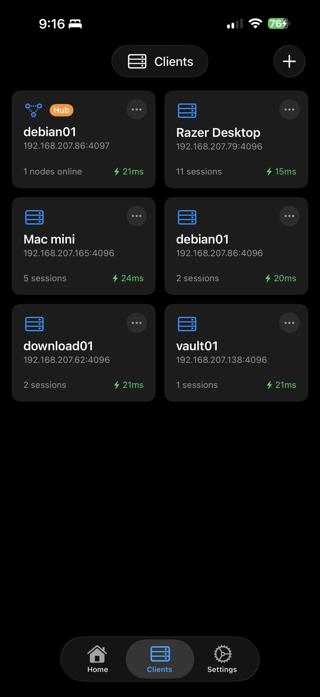
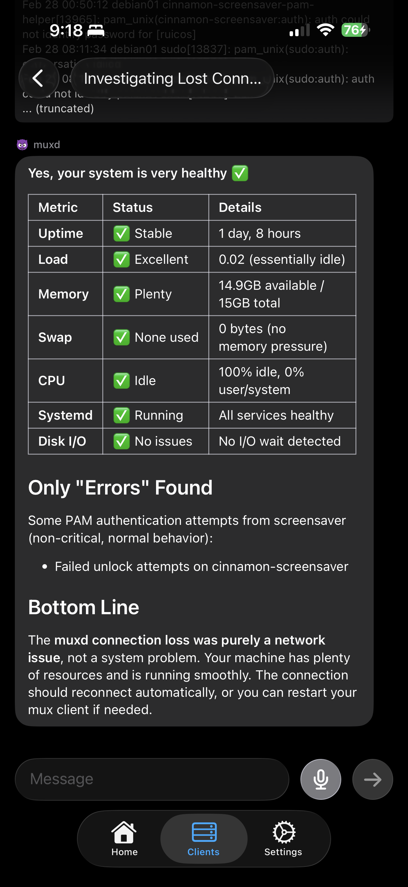

<h1 align="center">
  
  <br>
  muxd
</h1>

<p align="center">
  <b>An open-source AI coding agent that lives in your terminal.</b><br>
  <sub>Multiplex conversations across terminal, hub, and web. Branch, resume, and search your AI history like git.</sub>
</p>

<p align="center">
  
  <a href="https://github.com/batalabs/muxd/releases"></a>
  <a href="https://github.com/batalabs/muxd/commits/main"></a>
  <a href="#install"></a>
  
  <a href="LICENSE"></a>
</p>

> 📖 **Full documentation at [muxd.sh/docs](https://muxd.sh/docs)** -setup guides for [client](https://muxd.sh/docs/client) and [hub](https://muxd.sh/docs/hub) modes, [commands](https://muxd.sh/docs/commands), [tools](https://muxd.sh/docs/tools), and [configuration](https://muxd.sh/docs/configuration).

---

## Why muxd?

Most AI coding tools treat each conversation as disposable -close the window and it's gone. muxd saves everything to a local SQLite database so you can close your terminal, reboot, come back next week, and pick up exactly where you left off.

- **Persistent sessions** -conversations survive restarts. Search, branch, and resume any session by project or ID.
- **Branch and fork** -explore alternatives without losing your current thread, like git branches for conversations.
- **Project memory** -the agent remembers your conventions, architecture decisions, and gotchas across sessions.
- **Hub architecture** -run a central hub that coordinates multiple muxd daemons across machines. Connect from any TUI or mobile client and switch between nodes.
- **Multi-channel** -same agent from terminal TUI, headless daemon, hub, or the [mobile app](https://github.com/batalabs/muxd-mobile).
- **27 built-in tools** -file I/O, bash, git, web search, HTTP requests, SMS, scheduling, and more. See the [full list](https://muxd.sh/docs/tools).
- **Any provider** -Claude, GPT, Mistral, Grok, Fireworks, Ollama, and any OpenAI-compatible API. Switch models mid-session.

---

## Demo

<p align="center">
  
</p>

<p align="center">
  
  &nbsp;&nbsp;&nbsp;&nbsp;
  
</p>

---

## How it works

muxd has three modes depending on how you want to use it.

### Client (default)

Run `muxd` and you get a terminal TUI with a built-in agent server. Everything runs locally on one machine. Sessions are stored in a local SQLite database and persist across restarts.

```bash
muxd                              # new session
muxd -c                           # resume latest session
muxd --model openai/gpt-4o        # use a different model
```

### Daemon

Run `muxd --daemon` to start a headless agent server. This is useful for always-on machines where you want to connect from other clients (TUI, mobile app) without keeping a terminal open. Install it as a system service so it starts on boot.

```bash
muxd --daemon                     # start headless server
muxd --daemon --bind 0.0.0.0      # accept connections from other machines
muxd -service install             # install as system service
```

### Hub

The hub is a central coordinator that manages multiple muxd daemons (called nodes) across different machines. You run one hub and point your daemons at it. The [mobile app](https://github.com/batalabs/muxd-mobile) connects to the hub and lets you pick which node to talk to.

<picture>
  <source media="(prefers-color-scheme: dark)" srcset="assets/hub-architecture-dark.svg">
  <source media="(prefers-color-scheme: light)" srcset="assets/hub-architecture.svg">
  
</picture>

**Start a hub:**
```bash
muxd --hub --hub-bind 0.0.0.0     # hub on all interfaces
```

**Connect a daemon to the hub:**
```bash
muxd --daemon --bind 0.0.0.0      # start daemon
# then set the hub connection in config:
# /config set hub.url http://hub-ip:4097
# /config set hub.node_token <hub-token>
```

**Connect from a remote TUI:**
```bash
muxd --remote hub-ip:4097 --token <hub-token>
```

The hub tracks node health with heartbeats, proxies requests to the right node, aggregates sessions across all nodes, and shares project memory between them.

---

## Install

**Windows (PowerShell)**
```powershell
irm https://raw.githubusercontent.com/batalabs/muxd/main/install.ps1 | iex
```

**macOS / Linux**
```bash
curl -fsSL https://raw.githubusercontent.com/batalabs/muxd/main/install.sh | bash
```

**From source** (requires [Go 1.25+](https://go.dev/dl/))
```bash
go install github.com/batalabs/muxd@latest
```

**Prerequisites**: git (for undo/redo) and an API key for at least one [supported provider](https://muxd.sh/docs/configuration).

---

## Quick start

```bash
muxd                              # start a new session
```

Set your API key:
```
/config set anthropic.api_key sk-ant-...
```

Resume a session:
```bash
muxd -c                           # resume latest session
```

---

## Contributing

```bash
git clone https://github.com/batalabs/muxd.git
cd muxd
go build -o muxd.exe .
go test ./...
```

See [muxd.sh/docs/contributing](https://muxd.sh/docs/contributing) for code style and development guide.

---

## License

[Apache License 2.0](LICENSE)
