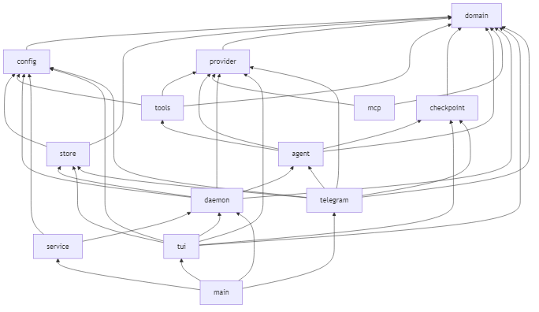
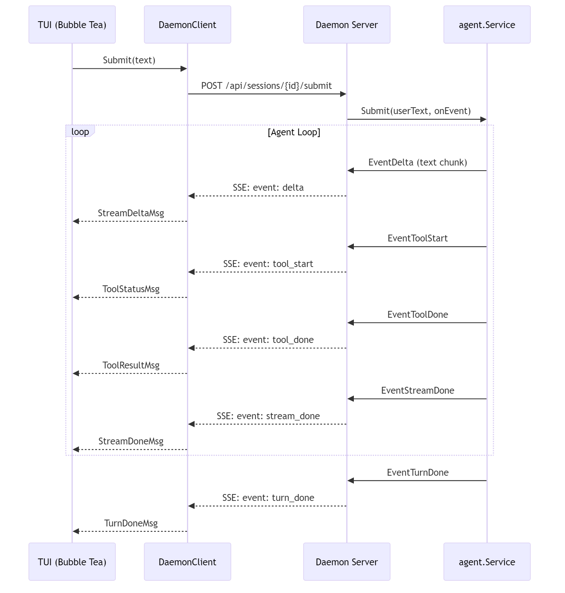
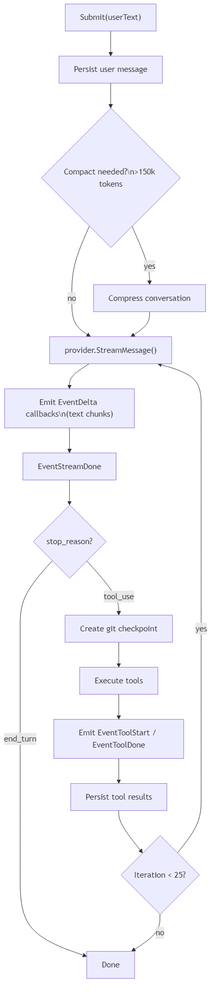

# Architecture

This document covers muxd's internal architecture for contributors.

## Project Structure

muxd uses `internal/` sub-packages organized by domain. `main.go` is pure wiring, all business logic lives in packages.

```
muxd/
├── main.go                         # entry point, flag parsing, wiring
├── internal/
│   ├── domain/                     # shared types (zero internal deps)
│   │   ├── types.go                # ContentBlock, TranscriptMessage, Session
│   │   ├── uuid.go                 # NewUUID()
│   │   └── commands.go             # CommandDef, CommandHelp()
│   ├── config/                     # configuration + preferences
│   │   ├── config.go               # ConfigDir, DataDir, LoadAPIKey
│   │   ├── preferences.go          # Preferences, ExecuteConfigAction
│   │   ├── pricing.go              # LoadPricing, SavePricing
│   │   └── telegram.go             # TelegramConfig
│   ├── store/                      # SQLite persistence
│   │   └── store.go                # Store, OpenStore, all CRUD methods
│   ├── provider/                   # LLM provider abstraction
│   │   ├── provider.go             # Provider interface, ToolSpec, ToolProp
│   │   ├── anthropic.go            # AnthropicProvider, SSE parsing
│   │   ├── openai.go               # OpenAIProvider
│   │   ├── ollama.go               # OllamaProvider
│   │   └── aliases.go              # ModelAliases, ResolveModel, ModelCost, BuildSystemPrompt
│   ├── tools/                      # tool definitions + execution (26 tools)
│   │   ├── tools.go                # ToolDef, ToolContext, AllTools, file/bash/grep/list_files/ask_user
│   │   ├── todo.go                 # todo_read, todo_write (in-memory per-session)
│   │   ├── memory.go               # memory_read, memory_write (per-project persistent facts)
│   │   ├── web.go                  # web_search (Brave API), web_fetch (HTML-to-text)
│   │   ├── patch.go                # patch_apply (unified diff parser + applier)
│   │   ├── plan.go                 # plan_enter, plan_exit, mode-aware tool filtering
│   │   ├── task.go                 # task (sub-agent spawner)
│   │   ├── x.go                    # X/Twitter tools (post, search, mentions, reply, schedule)
│   │   └── x_auth.go              # X OAuth 2.0 PKCE flow
│   ├── agent/                      # agent loop (adapter-independent)
│   │   ├── agent.go                # Service struct, Event types, NewService
│   │   ├── submit.go               # Submit method (multi-turn agent loop)
│   │   ├── compact.go              # CompactMessages, compaction summarization
│   │   ├── retry.go                # callProviderWithRetry, backoff logic
│   │   ├── session.go              # Resume, SetModel, SetProvider, SpawnSubAgent
│   │   ├── tools.go                # ExecuteToolCall, isWriteTool
│   │   └── repair.go               # repairDanglingToolUseMessages
│   ├── checkpoint/                 # git undo/redo
│   │   └── checkpoint.go           # git helpers (DetectGitRepo, StashCreate, etc.)
│   ├── daemon/                     # HTTP server + client + lockfile
│   │   ├── server.go               # Server, routes, handlers
│   │   ├── client.go               # DaemonClient, SSEEvent
│   │   ├── lockfile.go             # LockfileData, WriteLockfile, ReadLockfile
│   │   ├── lockfile_unix.go        # IsProcessAlive (//go:build !windows)
│   │   └── lockfile_windows.go     # IsProcessAlive (//go:build windows)
│   ├── mcp/                        # MCP (Model Context Protocol) server support
│   │   └── manager.go              # MCPManager, tool discovery, stdio transport
│   ├── service/                    # OS service management
│   │   └── service.go              # HandleCommand, install/uninstall/start/stop
│   ├── tui/                        # Bubble Tea TUI
│   │   ├── model.go                # Model, InitialModel, Update, View
│   │   ├── program.go              # var Prog, SetProgram()
│   │   ├── render.go               # RenderAssistantLines, markdown
│   │   ├── styles.go               # lipgloss styles
│   │   ├── complete.go             # autocomplete
│   │   ├── clipboard.go            # clipboard read/write
│   │   └── tool_picker.go          # interactive tool picker UI
│   └── telegram/                   # Telegram bot adapter
│       ├── adapter.go              # NewAdapter, Run, handleMessage
│       └── format.go               # MarkdownToTelegramHTML
├── assets/                         # images and diagrams
├── docs/
├── go.mod, go.sum, .gitignore
└── README.md
```

### Dependency Graph (no cycles)

<p align="center">
  
</p>

```
domain          <- leaf, no internal imports
  ^
config          <- imports domain
  ^
store           <- imports domain, config
  ^
provider        <- imports domain
  ^
tools           <- imports domain, config, provider
  ^
checkpoint      <- imports domain (just git operations)
  ^
agent           <- imports domain, provider, tools, checkpoint
  ^
mcp             <- imports domain, provider
  ^
daemon          <- imports domain, store, agent, config, provider
  ^
service         <- imports config, daemon
  ^
tui             <- imports domain, store, config, provider, daemon, checkpoint
  ^
telegram        <- imports domain, store, config, provider, agent, checkpoint
  ^
main            <- imports all
```

## Bubble Tea Model

muxd's TUI is built with [Bubble Tea](https://github.com/charmbracelet/bubbletea). The core pattern:

- **`tui.Model` struct**: single source of truth for all UI state (messages, input buffer, streaming state, etc.).
- **`Update(msg)`**: dispatches on message types. Keys are handled by `handleKey()`, slash commands by `handleSlashCommand()`, stream events by dedicated handlers.
- **`View()`**: pure render function, no side effects. Renders the input prompt, status footer, completion menu, and any in-progress streaming content.
- **`tui.Prog.Println()`**: pushes finalized content into native terminal scrollback. The active `View()` area only shows the current input and in-progress streaming.

Custom message types are defined at the top of `tui/model.go`:

- `StreamDeltaMsg`: a text chunk from the streaming response
- `StreamDoneMsg`: stream completed (carries token counts, stop reason)
- `ToolStatusMsg`: tool started executing on the server
- `ToolResultMsg`: tool finished executing
- `TurnDoneMsg`: full agent turn complete (server-driven)
- `AskUserMsg`: agent's ask_user tool needs user input
- `PasteMsg`: clipboard paste result
- `ClipboardWriteMsg`: clipboard copy result

## Client/Server Architecture

muxd runs in two modes:

1. **TUI mode** (default): Starts an embedded HTTP server, creates a `DaemonClient` to talk to it, and runs the Bubble Tea TUI. The TUI communicates with the agent loop exclusively through HTTP/SSE.

2. **Daemon mode** (`--daemon`): Starts the HTTP server headlessly on port 4096. Multiple TUI clients can connect to the same daemon via lockfile discovery.

### Lockfile Discovery

When the TUI starts, it checks `~/.local/share/muxd/server.lock` for an existing daemon. If found and healthy (PID alive + HTTP health check passes), it connects. Otherwise it starts an embedded server.

### SSE Event Flow

<p align="center">
  
</p>

## Agent Loop

The `agent.Service` (in `internal/agent/`) handles multi-turn tool use independently of any UI:

<p align="center">
  
</p>

Key details:
- Tools are executed **in parallel** by default, **sequentially** when `ask_user`, `plan_enter`, `plan_exit`, or `task` is present.
- The agent loop is capped at **60 iterations** to prevent runaway behavior.
- Cancellation via `Cancel()` stops at the next safe point.
- Checkpoints are created before each tool-use turn.
- **Plan mode**: When active, write tools (`file_write`, `file_edit`, `bash`, `patch_apply`) are excluded from the tool list sent to the provider. The agent can only read and search.
- **Sub-agents**: The `task` tool spawns a fresh `agent.Service` with no store (no persistence), no git, and `isSubAgent=true`. Sub-agents have all tools except `task` (prevents recursion). They run synchronously and return their output.
- **ToolContext**: Each tool execution receives a `*ToolContext` providing access to shared agent state: the working directory, the todo list, project memory, plan mode flag, and the sub-agent spawn callback.

## Streaming

muxd supports Anthropic, OpenAI, and Ollama streaming:

### Anthropic SSE Streaming

1. POST request with `stream: true` to `/v1/messages`.
2. Line-by-line parsing with `bufio.Scanner`.
3. Events: `content_block_start`, `content_block_delta`, `content_block_stop`, `message_delta`, `message_stop`.
4. Text deltas emitted via `EventDelta` callback.
5. Tool use blocks accumulate JSON incrementally, parsed on `content_block_stop`.

### OpenAI SSE Streaming

1. POST request with `stream: true` to `/v1/chat/completions`.
2. Same line-by-line SSE parsing.
3. Handles `tool_calls` in delta format, accumulating JSON arguments.

### Ollama Streaming

1. POST request to `/api/chat` with `stream: true`.
2. Newline-delimited JSON responses.
3. Converts Ollama's message format to the internal ContentBlock representation.

### Progressive Flush (TUI)

During streaming, long responses are progressively flushed to terminal scrollback:

1. Text deltas accumulate in `streamBuf`.
2. `flushStreamContent()` checks for safe flush points (paragraph boundaries).
3. `FindSafeFlushPoint()` verifies the point isn't inside a code fence.
4. Safe content is rendered and pushed to scrollback via `tui.Prog.Println()`.

## Session Persistence

### SQLite Schema

**sessions** table:
- `id` (UUID), `project_path`, `title`, `model`
- `total_tokens`, `input_tokens`, `output_tokens`, `message_count`
- `created_at`, `updated_at`

**messages** table:
- `id` (UUID), `session_id` (FK), `role`, `content`, `content_type`
- `tokens`, `created_at`, `sequence`

`content_type` is either `text` (plain string) or `blocks` (JSON array of content blocks, used for tool_use/tool_result messages).

The database uses **WAL mode** for concurrent read performance and has **foreign keys** enabled. Schema migrations run on startup with `IF NOT EXISTS` guards and `ALTER TABLE ADD COLUMN` with ignored errors for forward compatibility.

### Auto-titling

After the first assistant response, the session title is set to the first user message, truncated to 50 characters.

## Context Compaction

When input token count exceeds **150,000 tokens**, the conversation is compacted:

1. Keep the first user + assistant exchange (the "head").
2. Keep the last **20 messages** (the "tail"), starting on a user message to maintain proper alternation.
3. Serialize the dropped middle messages and call the LLM to generate a structured summary (topics, files modified, tools used, key decisions, current task state).
4. Replace the placeholder notice with the real summary. On LLM error, falls back to `"[N earlier messages were compacted. No summary available.]"`.

The summary is persisted via `SaveCompaction` so resumed sessions restore the LLM-generated context. The `compactIfNeeded` method handles this flow and runs automatically before each API call in the agent loop.

## OS Service Management

The `internal/service/` package supports installing muxd as a system service:

| Platform | Mechanism |
|----------|-----------|
| macOS | `launchd` plist in `~/Library/LaunchAgents/` |
| Linux | `systemd` user unit in `~/.config/systemd/user/` |
| Windows | Registry run key in `HKCU\...\Run` |

Commands: `muxd -service install|uninstall|status|start|stop`
